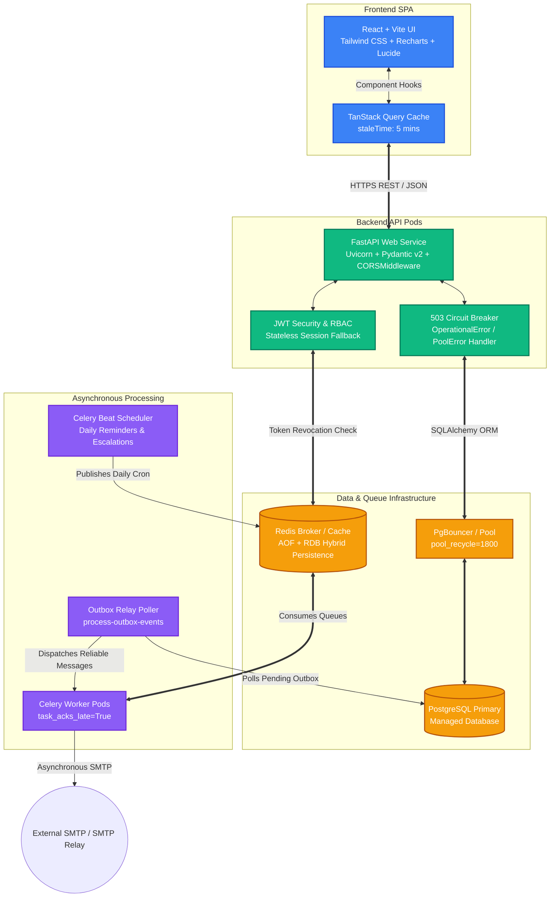

# 🚀 AtomQuest: Enterprise Goal & Performance Management Portal

[](https://fastapi.tiangolo.com)
[](https://react.dev)
[](https://www.typescriptlang.org/)
[](https://www.postgresql.org/)
[](https://redis.io/)
[](https://docs.celeryq.dev/)

## Live Demo

> [Link to Live Demo](https://atomquest-hackathon-07mk.onrender.com)


**AtomQuest** is a production-grade, highly resilient Performance Management and Objective Key Result (OKR) portal designed for modern enterprises. Built with a lightning-fast React single-page application and a robust FastAPI Python backend, AtomQuest seamlessly unites organizational goal setting, quarterly achievement check-ins, multi-tiered managerial approval workflows, and automated HR escalations into a single, bulletproof platform.

---

## 🏆 Hackathon Architectural Masterpiece

> [!IMPORTANT]
> **[👉 View the Complete Hackathon Architecture & System Flow Specification](./atomquest_architecture_and_flow.md)** for detailed sequence diagrams, ACID transaction guarantees, and outbox relay polling mechanics.

### 🌟 Key Technical Innovations
1. **Enterprise Resiliency & Self-Healing (Zero-Downtime Guarantee)**:
   - **Connection Pool Healing**: Configured with `pool_recycle=1800` and `pool_pre_ping=True` to automatically discard severed TCP sockets following cloud failovers.
   - **503 Circuit Breaking**: Intercepts `OperationalError` and `PoolError` to instantly return HTTP 503 envelopes with `Retry-After: 30` headers, allowing the React UI to degrade gracefully instead of hanging or displaying 500 error screens.
   - **Stateless JWT Fallback**: Wrapped token blacklist checks in `try...except redis.RedisError` blocks. If Redis goes offline, user sessions continue unhindered via cryptographic signature verification.
2. **Guaranteed Zero-Loss Asynchronous Queuing (Transactional Outbox Pattern)**:
   - Decouples background email alerts from API REST handling by inserting `OutboxEvent` records into PostgreSQL inside the **exact same ACID transaction** as goal sheet submissions, approvals, and returns.
   - A durable Celery Beat periodic poller sweeps pending outbox events every 5 minutes and delivers all lost notifications upon worker recovery.
3. **Extreme Performance Optimization**:
   - Eliminated ORM N+1 database bottlenecks during background jobs by utilizing bulk query mapping (`User.id.in_()`), dictionary lookups (`sheet_map`), and eager join loading (`joinedload`).
   - Standardized frontend TanStack React Query caching with a uniform 5-minute `staleTime`.

---

## 🏗 System Topology



---

## ⚡ Quick Start

Launch the entire stack locally with Docker Compose:

```bash
docker compose up --build
```

- **Frontend Application**: [http://localhost:3000](http://localhost:3000)
- **Interactive OpenAPI Docs**: [http://localhost:8000/docs](http://localhost:8000/docs)
- **API Health Check**: [http://localhost:8000/api/v1/health](http://localhost:8000/api/v1/health)

---

## 🔐 Demo Credentials

| Role | Email | Password | Features |
| :--- | :--- | :--- | :--- |
| **Admin** | `admin@atomquest.com` | `password` | Cycle management, organization dashboard, shared goals, audit log |
| **Manager** | `manager@atomquest.com` | `password` | Approval queue, inline editing, check-in reviews, team progress |
| **Employee** | `alice@atomquest.com` | `password` | Goal setting, weightage allocation (100% check), quarterly actuals |
| **Employee** | `bob@atomquest.com` | `password` | Personal goal sheet drafting & check-in submission |

---

## 📊 Automated Scoring Engine

AtomQuest features an advanced mathematical evaluation engine that calculates objective quarterly performance ratings based on Unit of Measure (UoM) configurations:

| UoM Type | Scoring Formula | Practical Example |
| :--- | :--- | :--- |
| **Min (Higher is Better)** | `min(actual / target, 1.0)` | Target: $100k, Actual: $85k → **85.0%** |
| **Max (Lower is Better)** | `min(target / actual, 1.0)` | Target: 5 Incidents, Actual: 2 → **100%** |
| **Timeline** | `1.0 if on/before target_date else 0.5` | Milestone completed on schedule → **100%** |
| **Zero (Strict UoM)** | `1.0 if actual == 0 else 0.0` | Zero compliance breaches → **100%** |

---

## 💻 Manual Development Setup

If you prefer running services directly outside Docker:

### 1. Backend Service
```bash
cd backend
python -m venv .venv
.venv\Scripts\activate     # On Windows
pip install -r requirements.txt
alembic upgrade head       # Apply database schema & Outbox table
uvicorn app.main:app --reload --port 8000
```

### 2. Frontend SPA
```bash
cd frontend
npm install
npm run dev
```

---

## 📄 License & Compliance
AtomQuest is fully open-source and built adhering to enterprise security best practices, immutable audit compliance, and strict Google-style Python docstring conventions.
