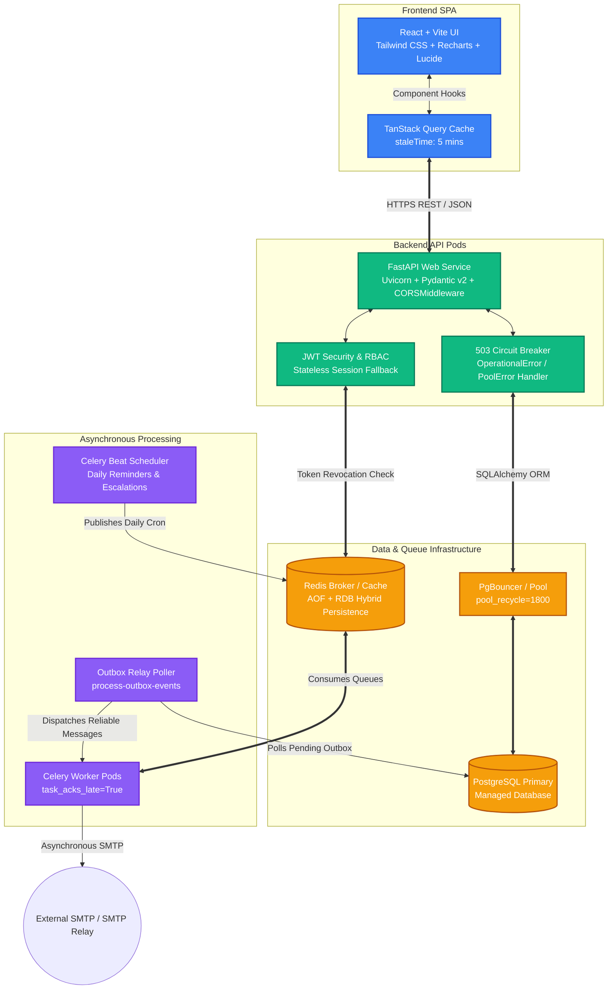
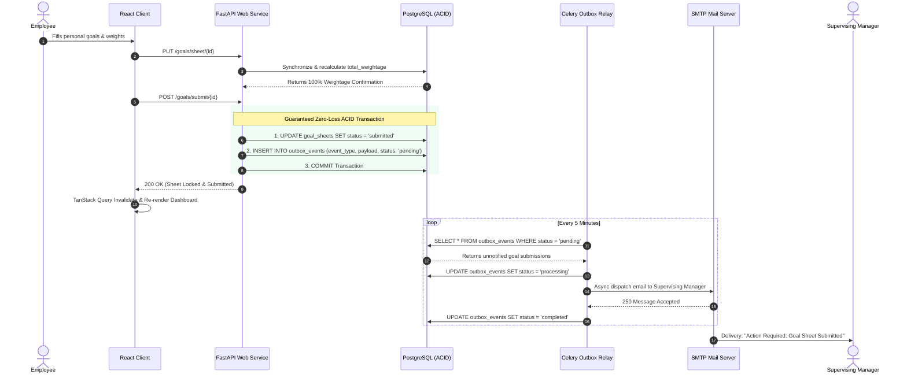
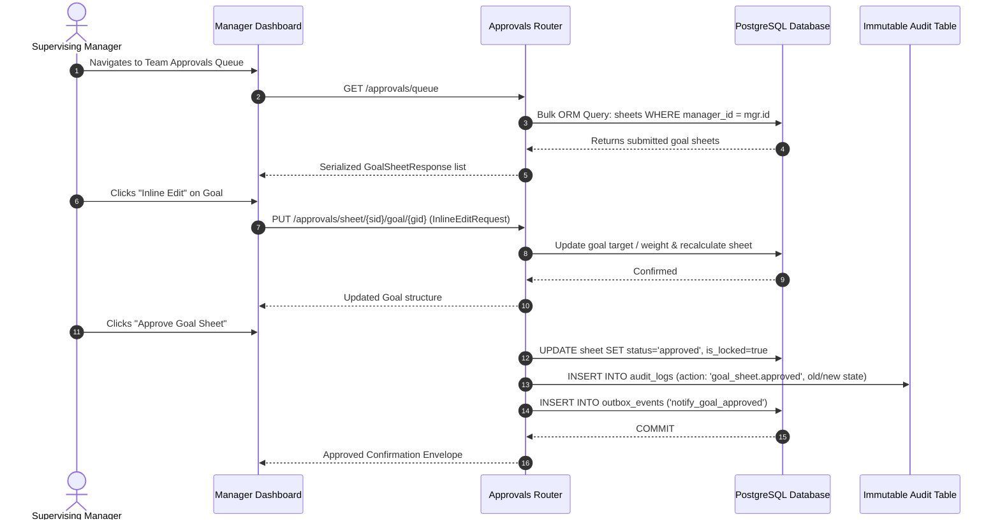
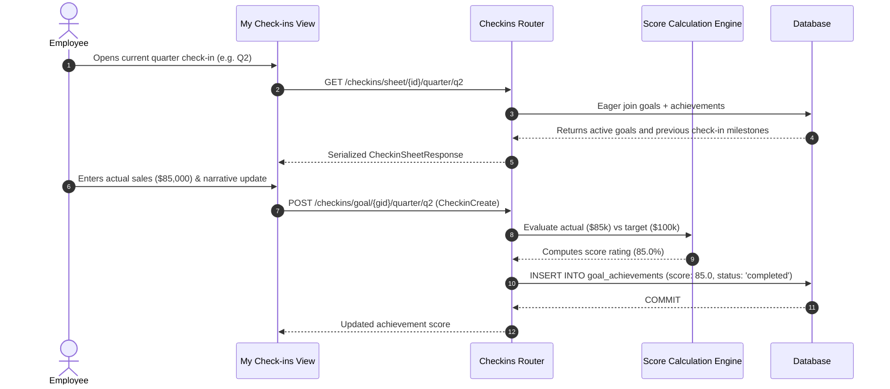
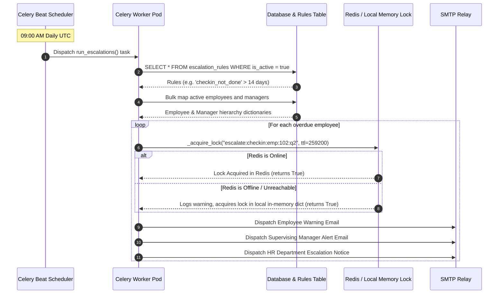

# AtomQuest: Enterprise Goal & Performance Portal
## Hackathon Architecture & System Flow Specification

**AtomQuest** is a production-grade, highly resilient Performance Management and Objective Key Result (OKR) portal designed for modern enterprises. Built with a responsive React single-page application and a robust FastAPI Python backend, AtomQuest seamlessly unites organizational goal setting, quarterly achievement check-ins, multi-tiered managerial approval workflows, and automated HR escalations into a single, lightning-fast platform.

---

## 1. High-Level Architectural Topology

AtomQuest is engineered for zero downtime, horizontal scalability, and strict data consistency. The architecture decouples synchronous REST API handling from intensive background reminder sweeps and email notifications using an ACID-guaranteed Transactional Outbox pattern.



---

## 2. Core Workflows & Data Flows

### Flow A: Goal Setting & Submission (The Transactional Outbox Pattern)
When an employee defines their quarterly OKRs, the backend dynamically validates personal weightages against shared organizational goals. Upon reaching precisely 100% personal allocation, the goal sheet is submitted. To guarantee that supervising managers are alerted even during network outages, AtomQuest records an `OutboxEvent` inside the **exact same ACID database transaction** as the sheet status update.



---

### Flow B: Managerial Review, Inline Editing & Approval
Managers access their approval queue containing all direct reports' submitted sheets. Managers can perform inline modifications to target metrics and weights or return sheets for revisions with check-in comments. Once approved, the sheet is permanently locked, and an immutable audit log is generated.



---

### Flow C: Quarterly Check-ins & Automated Scoring Engine
Throughout the performance cycle, employees submit quarterly check-ins for active goals. The backend actuals engine evaluates numerical target values or timeline completion dates to calculate standardized achievement scores.



---

### Flow D: Automated Reminders & Hierarchical Escalations
To ensure organizational alignment without manual HR chasing, a daily Celery cron worker evaluates active milestone windows and configurable escalation thresholds (e.g., goals unsubmitted after 7 days, check-ins uncompleted after 14 days).



---

## 3. Key Technical Innovations & Hackathon Showpieces

### 1. Enterprise Resiliency & Self-Healing Architecture
- **Zero-Crash Database Reconnection**: The database connection engine is configured with `pool_pre_ping=True` and `pool_recycle=1800`. If cloud load balancers or database failovers drop TCP sockets, stale connections are automatically discarded before executing queries.
- **503 Graceful Degradation Circuit Breaker**: If the managed PostgreSQL instance undergoes automated maintenance or failover, custom exception handlers (`OperationalError`, `PoolError`) immediately intercept failures and return HTTP 503 `Service Temporarily Unavailable` with `Retry-After: 30` headers. The frontend TanStack Query client intercepts this, displays an unobtrusive "Reconnecting" banner, and allows users to continue browsing cached data without UI freezing or 500 error screens.
- **Stateless Authentication Fallback**: Redis is utilized for high-speed JWT token revocation blacklisting. If Redis goes offline, `try...except` wrappers catch cache exceptions and seamlessly fallback to stateless cryptographic verification of short-lived JWT signatures, keeping user sessions active without interruption.

### 2. Guaranteed Zero-Loss Asynchronous Queue (Transactional Outbox)
Standard background task queues (`background_tasks.add_task` or direct Celery dispatching) lose data if the worker process crashes or the server restarts immediately after an API call. AtomQuest solves this enterprise challenge by implementing the **Transactional Outbox Pattern**:
- Every critical state change (goal submission, approval, or return) inserts an `OutboxEvent` record into PostgreSQL within the **exact same ACID transaction**.
- If Celery or Redis is offline at the moment of submission, the message remains safely persisted in PostgreSQL.
- A periodic Celery beat poller sweeps pending outbox events every 5 minutes and successfully delivers all queued emails once worker nodes recover.
- Worker tasks utilize late acknowledgements (`task_acks_late=True`) so that if a worker pod is forcibly restarted mid-execution, Redis re-queues the unacknowledged job for another healthy node.

### 3. Extreme Performance Optimization
- **N+1 ORM Query Elimination**: In standard ORM applications, looping through 1,000 employees and querying each manager or goal sheet individually creates severe database bottlenecks during background jobs. AtomQuest's services and Celery reminders utilize upfront bulk SQLAlchemy queries (`User.id.in_()`), eager loading (`joinedload`), and in-memory dictionary mapping (`sheet_map`, `mgr_map`), collapsing thousands of sequential queries into exactly 3 to 4 bulk queries per scheduled job.
- **TanStack Query SPA Optimization**: All frontend dashboard views utilize TanStack React Query with a uniform 5-minute `staleTime`. This eliminates duplicate REST fetching on component re-renders or tab switches, resulting in instantaneous page navigation.

### 4. Rigorous Security & Immutable Audit Trails
- **Cryptographic Security**: Password hashing utilizes `bcrypt` via `passlib`, and API authentication is secured via dual-token (Access + Refresh) JWT architecture with server-side blacklist capability.
- **Role-Based Access Control (RBAC)**: Custom dependency injectors (`require_roles("manager", "admin")`) enforce strict organizational boundaries, ensuring managers can only approve or view goal sheets of their direct reports.
- **Comprehensive Audit Log**: The database maintains an immutable `audit_logs` table. Every modification to a goal sheet or target metric records the exact user UUID, action string, precise timestamp, and JSONB snapshots of the `old_value` and `new_value`, providing perfect compliance and traceability.

---

## 4. Entity-Relationship Schema Summary

```
┌────────────────────────────────────────┐
│               USERS                    │
├────────────────────────────────────────┤
│ id (UUID, PK)                          │
│ email (String, Unique)                 │
│ hashed_password (String)               │
│ full_name (String)                     │
│ role (Enum: employee, manager, admin)  │
│ department_id (FK -> departments)      │
│ manager_id (FK -> users.id)            │
└───────────────────┬────────────────────┘
                    │ 1:M
                    ▼
┌────────────────────────────────────────┐
│             GOAL_SHEETS                │
├────────────────────────────────────────┤
│ id (UUID, PK)                          │
│ employee_id (FK -> users.id)           │
│ cycle_id (FK -> cycles.id)             │
│ status (Enum: draft, submitted...)     │
│ total_weightage (Decimal)              │
│ is_locked (Boolean)                    │
└───────────────────┬────────────────────┘
                    │ 1:M
                    ▼
┌────────────────────────────────────────┐
│                 GOALS                  │
├────────────────────────────────────────┤
│ id (UUID, PK)                          │
│ goal_sheet_id (FK -> goal_sheets.id)   │
│ title, description (String, Text)      │
│ weightage (Decimal)                    │
│ target_value (Decimal)                 │
│ uom_type (Enum: currency, timeline...) │
└───────────────────┬────────────────────┘
                    │ 1:M
                    ▼
┌────────────────────────────────────────┐
│          GOAL_ACHIEVEMENTS             │
├────────────────────────────────────────┤
│ id (UUID, PK)                          │
│ goal_id (FK -> goals.id)               │
│ quarter (Enum: q1, q2, q3, q4)         │
│ actual_value (Decimal)                 │
│ score (Decimal)                        │
└────────────────────────────────────────┘

┌────────────────────────────────────────┐
│             OUTBOX_EVENTS              │
├────────────────────────────────────────┤
│ id (UUID, PK)                          │
│ event_type (String: notify_submitted...)│
│ payload (JSONB)                        │
│ status (String: pending, completed...) │
│ created_at (DateTime, Indexed)         │
└────────────────────────────────────────┘
```
